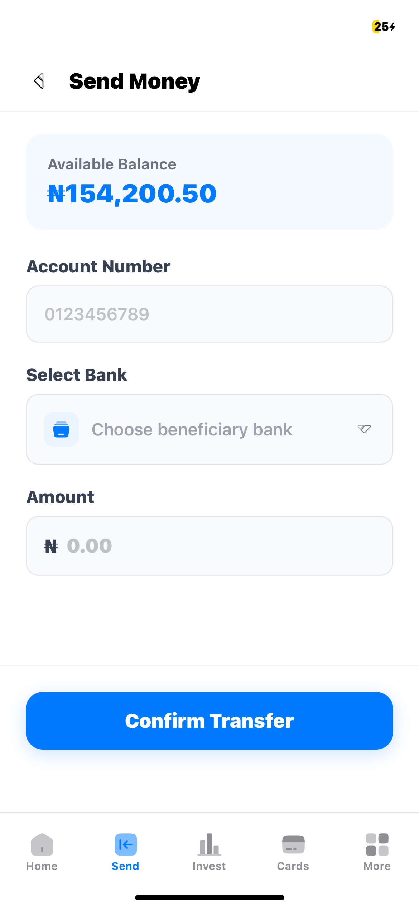

# SokoFunds - Modern Fintech Mobile Application

SokoFunds is a premium, high-performance mobile banking and investment application built with React Native and Expo. It provides a seamless experience for managing personal finances, transferring money, and tracking investments with a modern, sleek user interface.

## 🚀 Features

- **Account Overview**: Real-time balance tracking and recent transaction history.
- **Money Transfers**: Securely send money to friends and family with ease.
- **Investment Management**: Explore and track various investment opportunities including Real Estate and Tech Stocks.
- **Card Management**: Manage both virtual and physical cards, with the ability to freeze/unfreeze cards instantly.
- **Add Funds**: Simple and quick ways to top up your account balance.
- **Modern UI/UX**: Built with a clean, "glassmorphism" inspired design and smooth transitions.

## 🛠 Tech Stack

- **Framework**: [Expo](https://expo.dev/) (React Native)
- **Styling**: [NativeWind](https://www.nativewind.dev/) (Tailwind CSS for React Native)
- **State Management**: [Zustand](https://github.com/pmndrs/zustand)
- **Navigation**: [React Navigation](https://reactnavigation.org/) (Tabs & Stack)
- **Icons**: [React Native Solar Icons](https://github.com/v-mubarak/react-native-solar-icons)
- **Animation**: [React Native Reanimated](https://docs.swmansion.com/react-native-reanimated/) & [Worklets](https://github.com/chimeg/react-native-worklets)
- **Language**: TypeScript

## 📁 Project Structure

```text
├── assets/             # Images, fonts, and static assets
├── components/         # Reusable UI components
├── context/            # React Context providers
├── pages/              # Screen components (Home, Send, Invest, etc.)
├── provider/           # Application-wide providers
├── store/              # State management with Zustand
├── types/              # TypeScript type definitions
├── App.tsx             # Main entry point and navigation setup
└── tailwind.config.js  # Tailwind CSS configuration
```

## 🏁 Getting Started

### Prerequisites

- Node.js (v18 or later)
- npm or yarn
- Expo Go app on your mobile device (for testing)

### Installation

1. Clone the repository:

   ```bash
   git clone https://github.com/blackingg/SokoFunds.git
   cd SokoFunds
   ```

2. Install dependencies:

   ```bash
   npm install
   ```

3. Start the development server:

   ```bash
   npx expo start
   ```

4. Open the app:
   - Scan the QR code with your **Expo Go** app (Android) or **Camera** app (iOS).
   - Press `a` for Android emulator or `i` for iOS simulator.

## 📱 Screenshots

|              Home               |           Send Money            |               Cards               |
| :-----------------------------: | :-----------------------------: | :-------------------------------: |
|  |  |  |

## 📄 License

Distributed under the MIT License. See `LICENSE` for more information.
